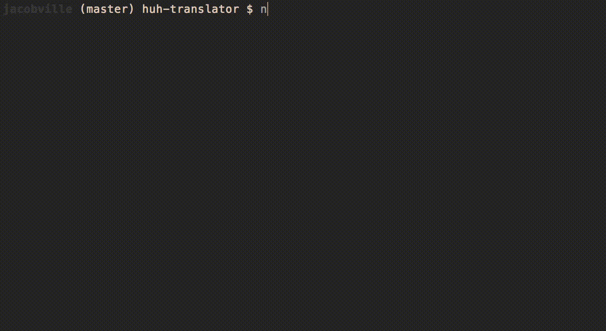

## Translator App for HCI Project 1

NOTE: The app designed **ONLY** for mobile! To view on desktop, go to developer settings and simulate view on a mobile device.

## How to run

Once the repository is saved locally, run:

`node app.js`

Then open the localhost server printed to the terminal in your web browser to view the application (make sure to view on mobile layout)

[]